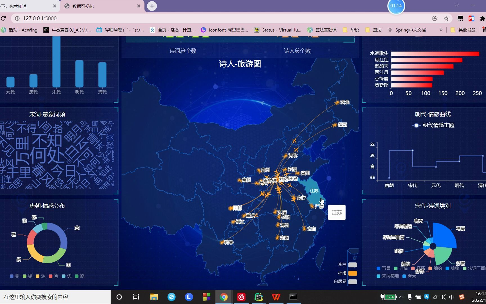
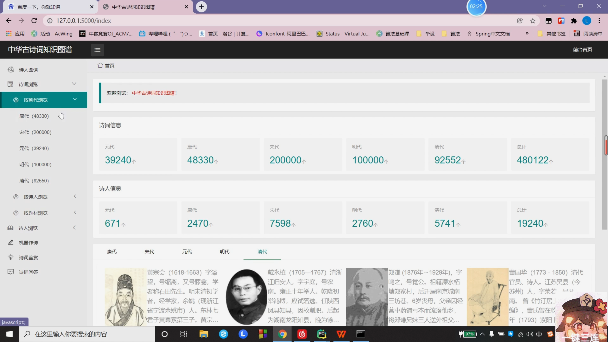
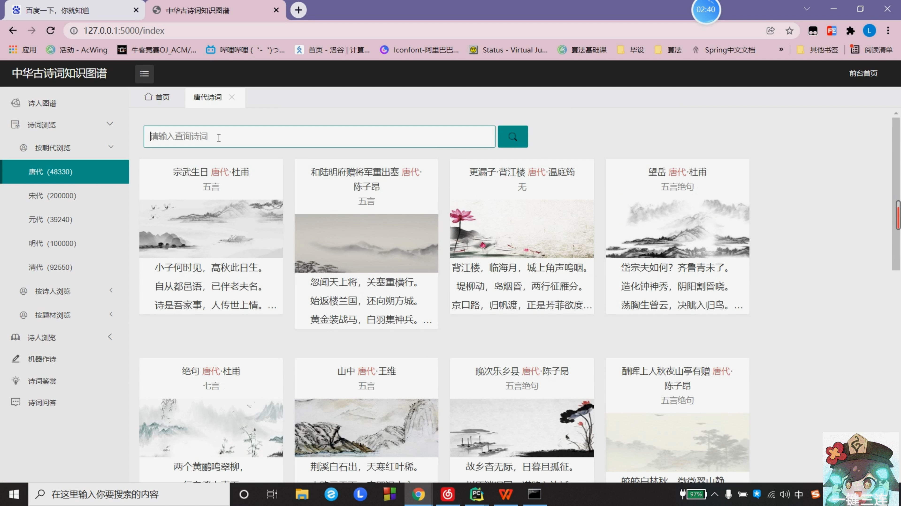
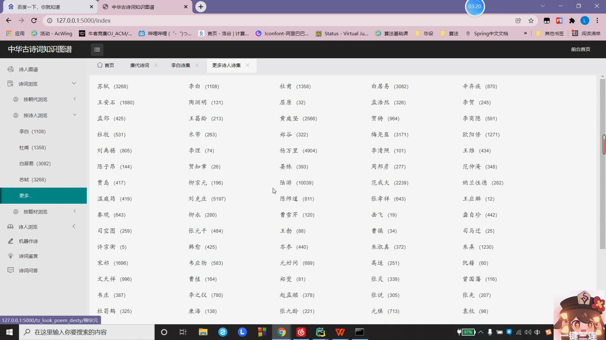
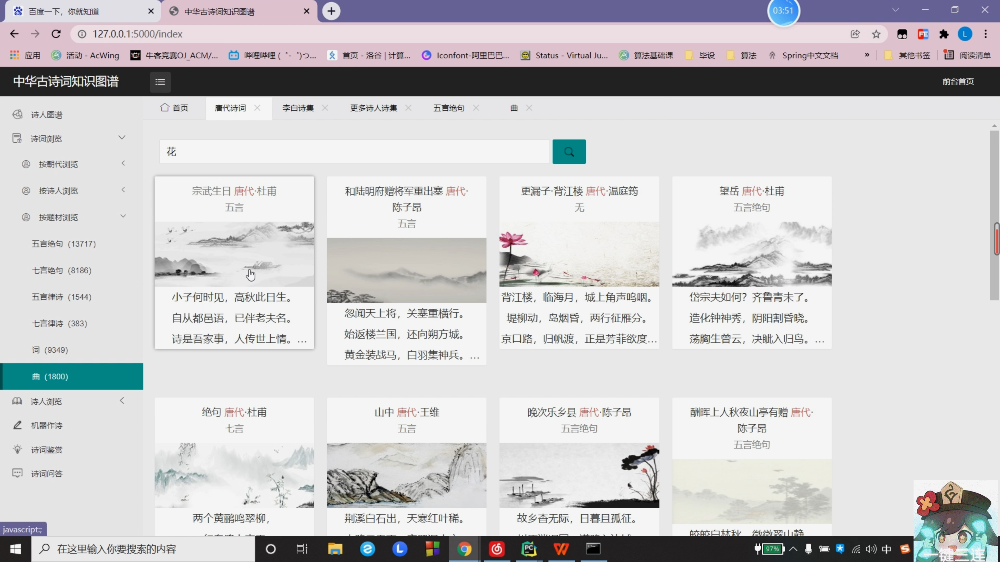
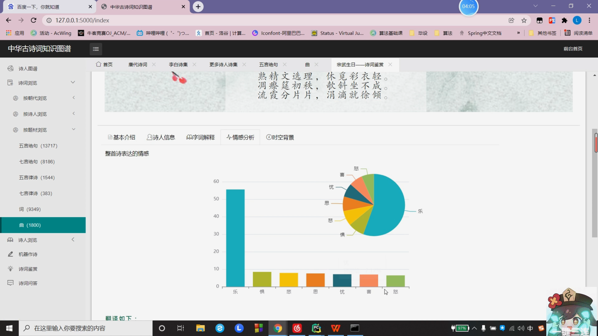
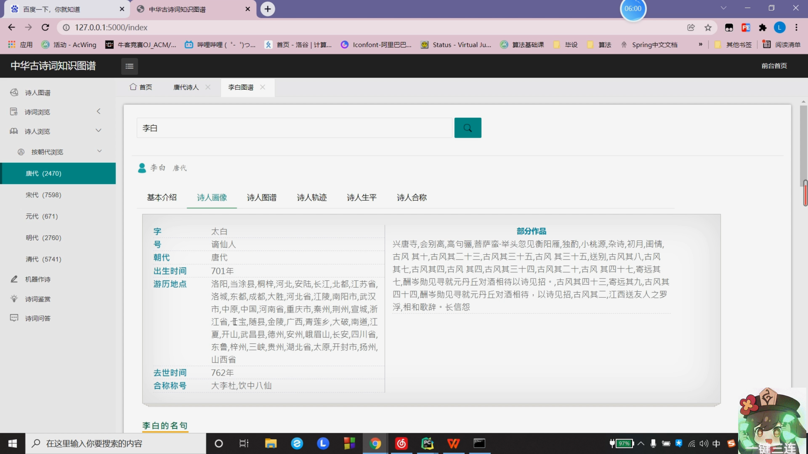
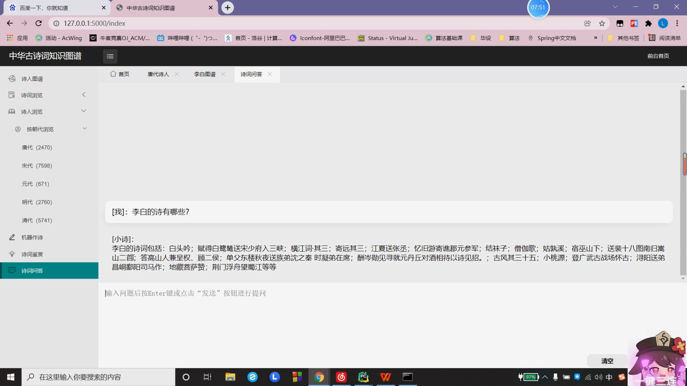
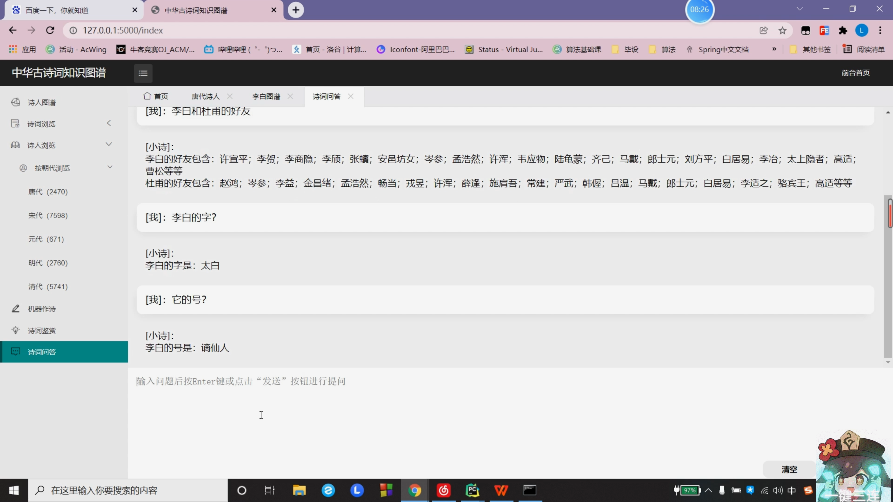

## 计算机毕业设计Python+LSTM中华古诗词知识图谱可视化 古诗词智能问答系统 古诗词数据分析 古诗词情感分析模型 自然语言处理NLP 机器学习 深度学习 人工智能 大数据毕业设计

## 要求
### 源码有偿！一套(论文 PPT 源码+sql脚本+教程)

### 
### 加好友前帮忙start一下，并备注github有偿纯python古诗词2025
### 我的QQ号是2827724252或者798059319或者 1679232425或者微信:bysj2023nb 或bysj1688

# 

### 加qq好友说明（被部分 网友整得心力交瘁）：
    1.加好友务必按照格式备注
    2.避免浪费各自的时间！
    3.当“客服”不容易，repo 主是体面人，不爆粗，性格好，文明人。
### 功能
有关知识图谱的毕设作品，领域是中华古诗词领域。
涉及到的技术包含：LSTM古诗生成，基于规则模板的智能问答，
七种细颗粒度的诗词情感分析，NLP自然语言解析，数据大屏可视化echarts展示。

### 演示视频
https://www.bilibili.com/video/BV1Xm421g74c/?spm_id_from=333.999.0.0

### 演示截图

